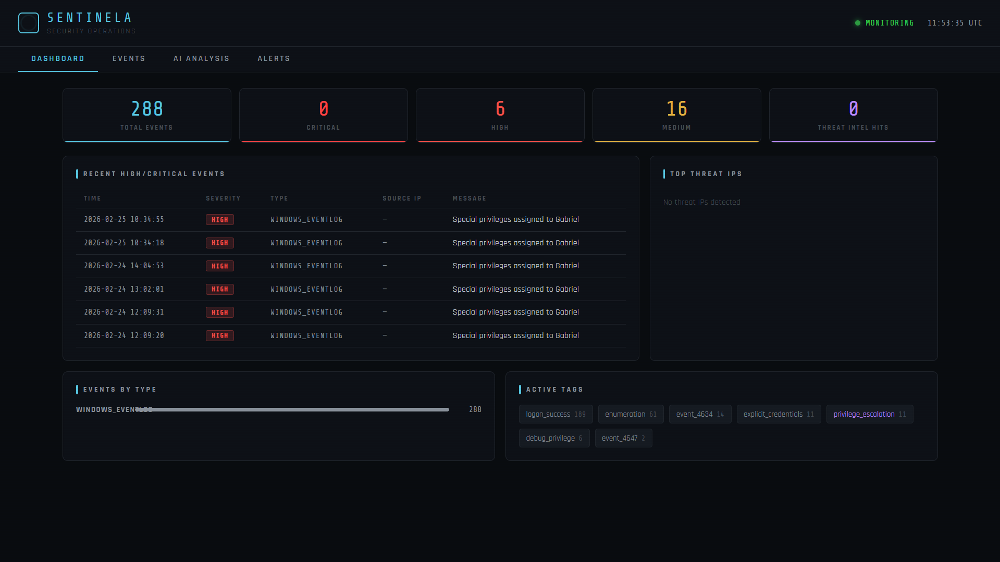

# SENTINELA
### AI-Powered Security Operations Platform

Sentinela is a full-stack security monitoring platform that combines real-time log ingestion, Elasticsearch-based event storage, and Claude AI-powered threat analysis in a unified interface. Built for small and mid-sized organizations that need SOC-level visibility without SOC-level budgets.

   


---

## What it does

Sentinela watches your infrastructure and tells you what's happening in plain language.

- **Real-time log collection** — ingests Windows Event Log security events continuously, filtering noise and keeping signal
- **AI threat analysis** — uses Claude to generate shift summaries, threat narratives, and IP investigation reports in plain English
- **Continuous monitoring** — a background daemon evaluates incoming events against detection rules and fires alerts automatically
- **Web dashboard** — dark terminal-style UI showing live event counts, threat IPs, severity breakdowns, and the alert log

---

## Architecture

```
Windows Event Log
       │
       ▼
  collector/          ← reads security events, normalizes to unified schema
       │
       ▼
Elasticsearch         ← stores all events, powers search and aggregations
       │
  ┌────┴────┐
  │         │
analyst/  monitor/    ← Claude API analysis    ← continuous threat detection
  │         │
  └────┬────┘
       │
  dashboard/           ← Flask + vanilla JS web UI
```

---

## Features

### Log Ingestion
- Windows Event Log collector watching 18 security-relevant event IDs
- Intelligent filtering — ignores noisy credential manager reads, focuses on authentication and privilege events
- Checkpoint-based polling so no event is processed twice
- Normalizes all events to a unified schema regardless of source

### Detection Rules
The monitor daemon evaluates every new event batch against 7 built-in rules:
- Successful login from threat-intel-matched IP (critical)
- Data exfiltration to known-malicious IP (critical)
- Internal port scan / lateral movement (high)
- IDS signature match (high)
- Privilege escalation (high)
- SSH brute-force burst (medium)
- New connection from known-malicious IP (medium)

### AI Analysis (powered by Claude)
- **Threat Narratives** — identifies attack chains and explains them with evidence, MITRE ATT&CK mapping, and confidence levels
- **Shift Summary** — overall situation assessment with prioritized action items
- **IP Investigation** — full profile of a suspicious IP including timeline, verdict, and remediation steps
- **Config Suggestions** — specific firewall rules and hardening commands tailored to detected threats

### Dashboard
- Live stats: total events, critical/high/medium counts, threat intel hits
- Recent high/critical events table
- Top threat IPs with event counts
- Events by type breakdown
- Active tags visualization
- Alert log with acknowledge workflow
- Monitor status indicator

---

## Quick Start

### Prerequisites
- Python 3.11+
- Docker Desktop
- Anthropic API key

### 1. Clone and install dependencies
```bash
git clone https://github.com/gabriel-morim/sentinela.git
cd sentinela
pip install -r requirements.txt
```

### 2. Configure environment
```bash
cp .env.example .env
# Edit .env and add your ANTHROPIC_API_KEY
```

### 3. Start Elasticsearch
```bash
docker-compose up -d
```

### 4. Generate synthetic data (optional — for testing)
```bash
python generator/synthetic_logs.py
python ingestion/pipeline.py synthetic_logs.txt
```

### 5. Start the platform
Open three terminals:

**Terminal 1 — Web dashboard**
```bash
python dashboard/server.py
```

**Terminal 2 — Windows log collector (run as Administrator)**
```bash
python collector/windows_collector.py --historical
```

**Terminal 3 — Continuous monitor**
```bash
python monitor/daemon.py
```

Open `http://localhost:8080`

---

## Configuration

Copy `.env.example` to `.env` and configure:

```env
ANTHROPIC_API_KEY=your-key-here
ES_HOST=http://localhost:9200
ES_INDEX=sentinela-events
LOOKBACK_MINUTES=120
MAX_EVENTS_PER_ANALYSIS=100
MONITOR_INTERVAL=60

# Optional alert channels
ALERT_WEBHOOK_URL=https://hooks.slack.com/...
ALERT_EMAIL_TO=security@yourcompany.com
```

---

## Project Structure

```
sentinela/
├── analyst/
│   └── analyze.py          # Claude API integration — all AI analysis functions
├── collector/
│   └── windows_collector.py # Windows Event Log real-time collector
├── dashboard/
│   ├── index.html          # Single-file web UI
│   └── server.py           # Flask API server
├── generator/
│   └── synthetic_logs.py   # Synthetic security event generator for testing
├── ingestion/
│   └── pipeline.py         # Log normalization and Elasticsearch indexing
├── monitor/
│   └── daemon.py           # Continuous monitoring daemon with detection rules
├── query/
│   └── search.py           # Elasticsearch query helpers
├── schema/
│   └── normalized_event.json # Unified event schema definition
├── docker-compose.yml      # Elasticsearch + Kibana
└── requirements.txt
```

---

## Detection Coverage

| Event ID | Description | Sentinela Action |
|----------|-------------|-----------------|
| 4624 | Successful logon | Logged, flagged if network/RDP/cleartext |
| 4625 | Failed logon | Logged, contributes to brute-force detection |
| 4648 | Explicit credential use | Logged, flagged as medium severity |
| 4672 | Special privileges assigned | Logged, flagged if non-SYSTEM account |
| 4720 | User account created | Flagged as high severity |
| 4732 | Member added to group | Flagged high if admin group |
| 4798/4799 | Group membership enumerated | Logged as reconnaissance indicator |

---

## Roadmap

- [ ] Windows Service installer (auto-start on boot)
- [ ] Network firewall log ingestion (pfSense, Windows Firewall)
- [ ] AWS CloudTrail ingestion
- [ ] Alert deduplication and incident grouping
- [ ] Email and Slack alert delivery
- [ ] Multi-host monitoring

---

## Tech Stack

- **Backend:** Python, Flask, Elasticsearch
- **AI:** Anthropic Claude API
- **Frontend:** Vanilla JS, HTML/CSS
- **Infrastructure:** Docker, Elasticsearch 8.x
- **Log collection:** pywin32 (Windows Event Log API)

---

## Author

Built by [Gabriel Morim](https://github.com/gabriel-morim) — data engineer and security enthusiast.

---

## License

MIT
